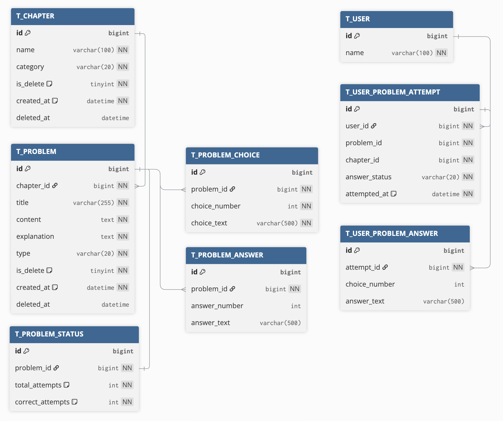
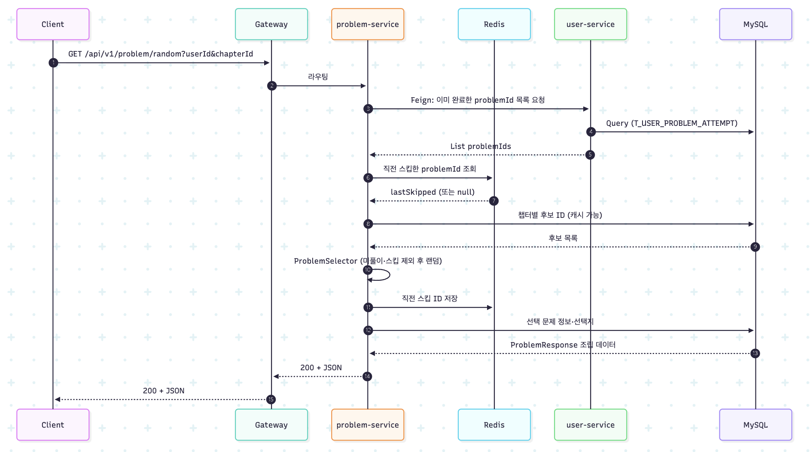

# studyPlatform

## 프로젝트 개요

Spring Cloud 기반 **학습/퀴즈 플랫폼** 백엔드입니다.

### 구현 범위

**단원 (chapter-service)**

- 단원 목록 조회

**문제 (problem-service)**

- **랜덤 문제 1건 조회 / 문제 건너뛰기**
- **문제 제출**
- **챕터별 문제 목록**

**사용자·풀이 이력 (user-service)**

- **풀이한 문제 목록**
- **풀이 상세**

**공통**

- `common_core`(예외·Enum), `common_web`(JPA·Redis·Swagger·QueryDSL), `common_api`(Feign DTO/클라이언트)
- `flyway`로 스키마 마이그레이션, `docker/` Compose로 DB·WAS 일괄 기동

### 설계 시 주로 고려한 사항

- **DDD (Aggregate Root)**: `Problem` 엔티티가 `choices`, `answers`, `status`를 소유하며 채점 로직(`grade()`)을 직접 수행. 문제 유형(`ProblemType`)은 엔티티가 관리하며, 클라이언트 요청이 아닌 서버가 판단. Service는 오케스트레이션만 담당
- **멀티 모듈 + 경계**: 도메인별 Gradle 모듈, 서비스 간 호출은 `common_api` Feign + `/internal/v1/**` REST
- **CQRS**: 각 모듈의 Repository를 읽기(`ProblemRepository`, `UserRepository`)와 쓰기(`ProblemCommandRepository`, `UserCommandRepository`)로 분리
- **DTO 계층**: `req` / `res` 분리, QueryDSL 조건은 `repository/support/*QuerySupport`로 재사용(Chapter·Problem·User)
- **트랜잭션·비동기**: DB 쓰기는 `ProblemWriteService` 등 `@Transactional` 격리, Feign·`@Async`는 트랜잭션 밖(`ProblemAsyncService`)
- **동시성**: `ProblemStatus` 갱신은 dirty checking 대신 단일 `UPDATE` 쿼리
- **테스트**: 도메인·서비스·MOCK 테스트 + `problem`·`user` 일부 `@SpringBootTest` 통합 테스트(H2·Feign MOCK)

---

## 기술 스택

| 분류          | 기술                                                                   | 버전                           |
|-------------|----------------------------------------------------------------------|------------------------------|
| Language    | Java                                                                 | 21                           |
| Framework   | Spring Boot                                                          | 3.5.3                        |
| Cloud       | Spring Cloud (BOM)                                                   | 2025.0.0                     |
| API Gateway | Spring Cloud Gateway (WebFlux)                                       | (BOM)                        |
| Discovery   | Netflix Eureka Client                                                | (BOM)                        |
| RPC         | OpenFeign                                                            | (BOM)                        |
| ORM         | Spring Data JPA + QueryDSL                                           | QueryDSL 5.1.0               |
| DB          | MySQL (로컬/Docker), H2(테스트)                                           | 8.0                          |
| Cache       | Spring Cache + Redis                                                 | —                            |
| Docs        | SpringDoc OpenAPI                                                    | 2.8.16                       |
| Migration   | Flyway                                                               | (Boot 관리)                    |
| Style       | Naver Checkstyle                                                     | `naver-checkstyle-rules.xml` |
| Test        | JUnit 5, Mockito, `@DataJpaTest` / `@WebMvcTest` / `@SpringBootTest` | —                            |

---

## 아키텍처

```
studyPlatform/
├── buildSrc/                 # Gradle 플러그인 (spring-cloud-app, querydsl 등)
├── common_core/              # 예외, ErrorCode, 공통 Enum·상수
├── common_web/               # JPA, Redis, Swagger, QueryDSL 공통 설정
├── common_api/               # Feign 인터페이스·공유 DTO
├── eureka/                   # 서비스 디스커버리 (:8761)
├── gateway/                  # API Gateway + Swagger 집계 (:8080)
├── chapter/                  # 단원 API (:8083)
├── problem/                  # 문제·랜덤·제출·내부 problem API (:8082)
│   ├── entity/               # Problem(Aggregate Root), ProblemChoice, ProblemAnswer, ProblemStatus
│   ├── repository/           # ProblemRepository(읽기), ProblemCommandRepository(쓰기), support/
│   ├── service/              # ProblemService(Application Service), ProblemWriteService, ProblemApiMapper
│   ├── utils/                # ProblemHelper, ProblemSelector
│   └── config/               # Async, Random·Selector 빈
├── user/                     # 풀이 이력·내부 user API (:8081)
│   ├── repository/           # UserRepository(읽기), UserCommandRepository(쓰기), support/
│   └── service/
└── flyway/                   # DB 마이그레이션 전용 모듈
```

**런타임 흐름 (요약)**  
`Client → Gateway(8080) → Eureka lb://{service} → MySQL + Redis`  
서비스 간: `Feign` → `user-service` / `problem-service`의 `/internal/v1/...`

---

## ERD


---

## 시퀀스 다이어그램 (Mermaid)

### 1) 랜덤 문제 조회 (`GET /api/v1/problem/random`)




---

## API 명세

> 상세 스펙은 **Gateway `8080`** 기준 Swagger UI에서 서비스별 API 문서를 확인하면 됩니다 (`springdoc` 다중 URL 집계).

### problem-service (외부, Gateway `/api/v1/problem`)

| Method | Endpoint                             | 설명                        |
|--------|--------------------------------------|---------------------------|
| GET    | `/api/v1/problem/random`             | 단원별 랜덤 1문제 (미풀이·직전 스킵 제외) |
| POST   | `/api/v1/problem/{problemId}/submit` | 답안 제출·채점 (문제 유형은 서버가 판단) |
| GET    | `/api/v1/problem/list`               | 챕터별 문제 목록                 |

### user-service (외부, Gateway `/api/v1/user`)

| Method | Endpoint                                           | 설명                        |
|--------|----------------------------------------------------|---------------------------|
| GET    | `/api/v1/user/{userId}/problem/solved/list`        | 풀이한 문제 목록                 |
| GET    | `/api/v1/user/{userId}/problem/solved/{problemId}` | 풀이 상세 (문항은 problem Feign) |

### chapter-service (외부, Gateway `/api/v1/chapter`)

| Method | Endpoint  | 설명                 |
|--------|-----------|--------------------|
| GET    | (단원 목록 등) | 필터·검색 — Swagger 참고 |

### internal (Feign 전용, Swagger `@Hidden` 권장)

| 대상              | 경로 예시                      | 설명              |
|-----------------|----------------------------|-----------------|
| user-service    | `/internal/v1/user/...`    | 풀이 ID 목록, 시도 저장 |
| problem-service | `/internal/v1/problem/...` | 문제 요약/상세 조회     |

---

## 실행 방법

```bash
# DB + Redis (docker 디렉터리)
cd docker && docker-compose -f docker-compose-db.yml up -d

# (선택) 전체 WAS — docker-compose-was.yml 및 docker/yml/application-*.yml 참고

# 로컬 멀티 프로세스 (포트: Eureka 8761, Gateway 8080, user 8081, problem 8082, chapter 8083)
./gradlew :eureka:bootRun
./gradlew :gateway:bootRun
./gradlew :user:bootRun
./gradlew :problem:bootRun
./gradlew :chapter:bootRun
```

- DB 최초 스키마: **`flyway`** 모듈 1회 실행 또는 운영 정책에 맞는 마이그레이션 파이프라인 사용
- 환경 변수·연결 정보: `docker/yml/application-web.yml` 등 참고 (`CLAUDE.md` Docker 절)

```bash
# 빌드·테스트
./gradlew build
./gradlew :problem:test :user:test
```

---

## 웹 테스트용 URL

| 리소스             | URL (기본)                                |
|-----------------|-----------------------------------------|
| Swagger UI (집계) | `http://localhost:8080/swagger-ui.html` |
| Eureka 대시보드     | `http://localhost:8761`                 |
